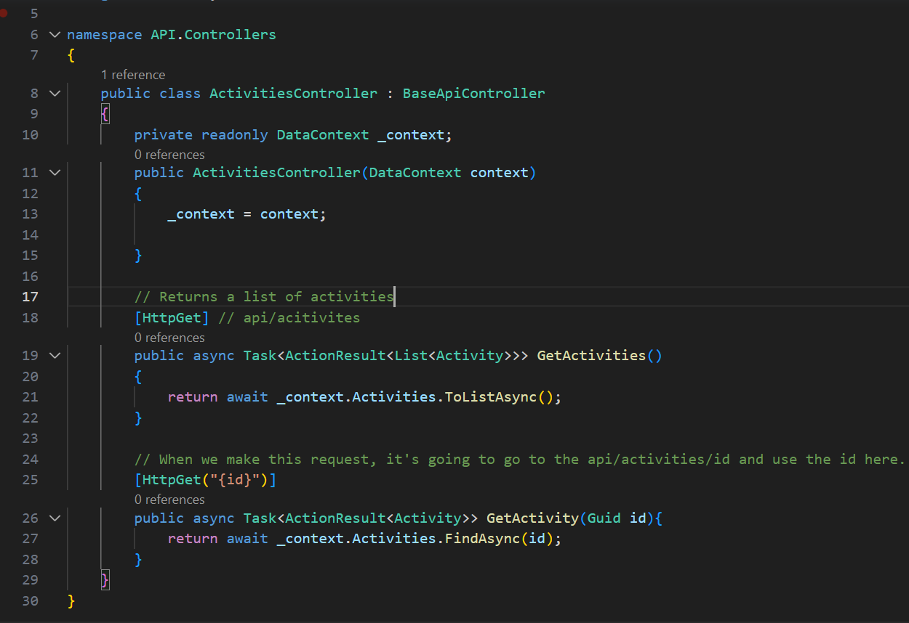

# C# Notes
> ___`Guid:`___ Stands for globally unique identifier. It's a 128 bit integer that's used to uniquely identify something. 
> : It's used as a primary key in a DB


# The Backbone Of DOTNET Apps
## Entities
> There are various entities named API, Application, Domain and Persistence.
> : 

## A Sample Domain Entity
> 

> DB Sets stand for the table that we're going to create.

## Creating a Migration
> It creates the code that generates the schema we need inside our database.

```dotnet 
dotnet ef 
```
> stands for dotnet entitiy framework


> Creating first migration
```dotnet
dotnet ef migrations add InitialCreate -s API -p .\Persistence\
```
> It creates a folder named Migrations inside Persistence folder. There are 3 files and bottom 2 are for the db to rollback when neeeded.

> When we run our app, the no-hot-reload will watch our file and reload the server when a change occurs. Similar to nodemon.
```dotnet
dotnet watch --no-hot-reload
```

> We create controllers so we can query the data and return it inside of an HTTP response.

> The API creation is similar to the Spring framework.
> : 