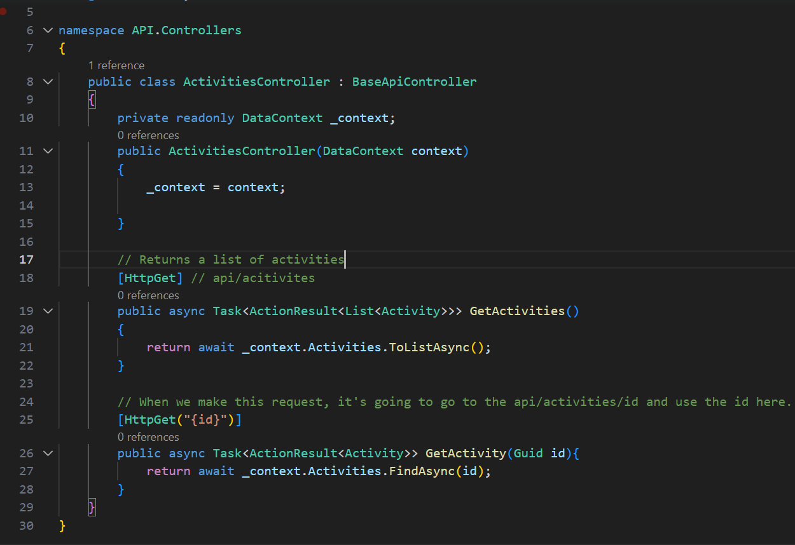

# C# Notes
> ___`Guid:`___ Stands for globally unique identifier. It's a 128 bit integer that's used to uniquely identify something. 
> : It's used as a primary key in a DB

# CQRS - Command Query Responsibility Segregation | Command & Query Seperation
> CQRS is the pattern and architecture we're using to create our CRUD operations.
> : CQRS is concerned with the flow of data.

| Command | Query   |
|-------------- | -------------- |
| Does something| Answers a question|
| Modifies state| Does not modify state|
| Should not return a value| Should return value|


# The Backbone Of DOTNET Apps
## Entities
> There are various entities named API, Application, Domain and Persistence.
> : 

## A Sample Domain Entity
> 

> DB Sets stand for the table that we're going to create.

## Creating a Migration
> It creates the code that generates the schema we need inside our database.

```dotnet 
dotnet ef 
```
> stands for dotnet entitiy framework


> Creating first migration
```dotnet
dotnet ef migrations add InitialCreate -s API -p .\Persistence\
```
> It creates a folder named Migrations inside Persistence folder. There are 3 files and bottom 2 are for the db to rollback when neeeded.

> When we run our app, the no-hot-reload will watch our file and reload the server when a change occurs. Similar to nodemon.
```dotnet
dotnet watch --no-hot-reload
```

> We create controllers so we can query the data and return it inside of an HTTP response.

> The API creation is similar to the Spring framework.
> : 

> API depends on Application which depends on Domain.
> - We have a Persistence (read/write/delete) records to disk or database, which has a dependency from the application and to the domain.

## Benefit Of Using SQLite For Development
> It makes the code portable. We can save our database into the source control

> The business logic will go into the Application layer.

## Some Notes About The Mediator Pattern
> Mediator pattern desing allows only one-way data flow. 
> : The communication is one way between the API and the Application layer.
>
> To handle dependencies, we install Mediatr extension from NuGet gallery.
> : 


> The dotnet restore is handy when you're not getting an access to a particular class/interface you think you should have access to.
> ```dotnet 
> dotnet restore
> ```

> There's a easier way to set properties of request items. An extension called AutoMapper Dependeny Injection from NuGet gallery will be used.
> 

> AcitiviesController is simply where we store our API methods.

## About HTTP 204
> If you run get query on an element that is deleted and there's no error handling in the get API in case the content does not exists, Postman will return HTTP 204 - NO CONTENT code.

## Cancellation Notses - What Are They?
> Say the highlighted request here takes 30 seconds to process.
> 
>
> Without utilising CancellationTokens the requests will keep on going on the server side regardless of user's action.

## Clean Architecture Pattern
> Allows easily mapping of different layers, by Uncle Bob 2012.
> 
>
> Set of recommendations about how you can build an Application.

## CQRS + Mediator pattern
> ___`CQRS:`___ Stands for Command and Query Responsibility Segregation
>
> CQRS is generally mentioned with `Event Sourcing`.
> - Event sourcing is quite complex but an excellent tool. 
> -


## Mediator Pattern
> Mediator specifically relates to how we're using the flow of control in our application.
> - Our API Controllers send an Object to our Mediator, 
> - Mediator has a Handler that has a handler that's going to process our business logic and then
> it's going to send object back out to our API Controller, which in turn will return the object
> to the client inside an HTTP Response.

---
# React | Frontend Notes
> Folder Structure consists of 2 main folders:
> 1. ___`app folder:`___ Will have cross-cutting concerns,
> 2. ___`features folder:`___ Will contain all our our individual features that we build in this application

> For the sake of using standard conventions, we name our interfaces beginning with a capital I `I`.

### Remember that we need something (such as the div we use inside our return statements) while returning jsx, why we need it?
> If we don't have anything, then we're not allowed to return different elements inside a React Component, we can only return a single element but it can have as many children as it likes. 
> - To overcome this issue, we're using the extra div container. Preferably a Fragment could be used. An empty tag will do the job as well since its basically the shortcut of using a Fragment.
```Typescript
<>
  <Navbar />
  <Container style={{marginTop: '7em'}}>
    <List>
      {activities.map((activity) => (
        <List.Item key={activity.id}>{activity.title}</List.Item>
      ))}
    </List>
  </Container>
</>
```
>
> ___`Note:`___ On the inspection tool, if you use an empty div then there will be a div elemen with no attributes inside displayed as the parent of all children. If you replace that with a Fragment, the div will have class="root".
> 
>  


---