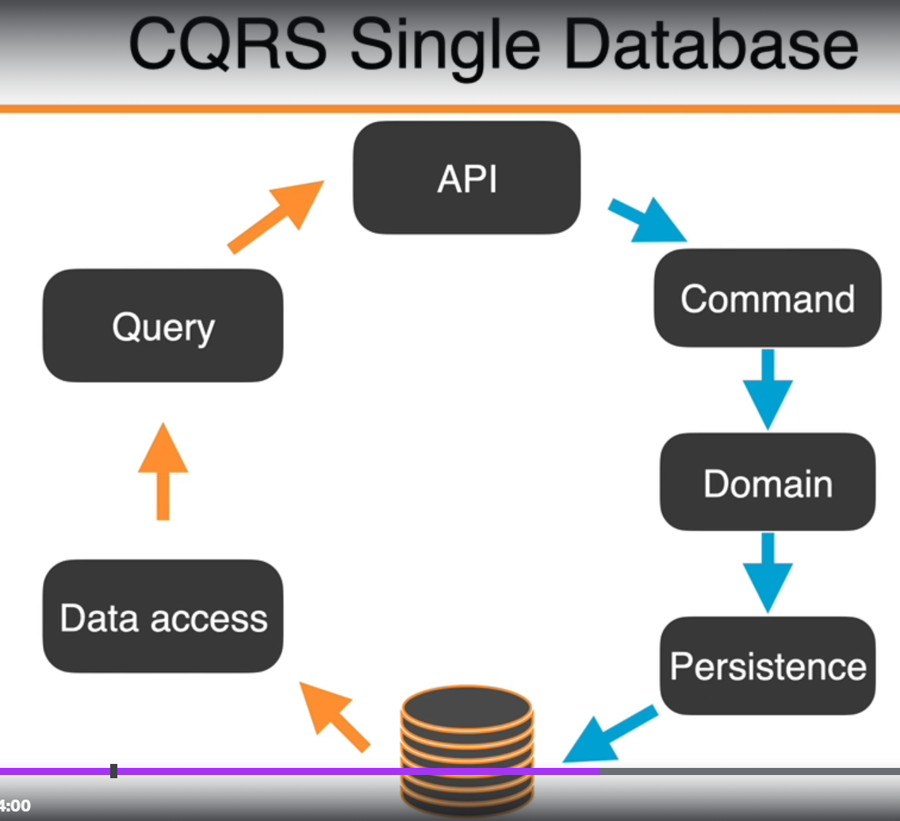
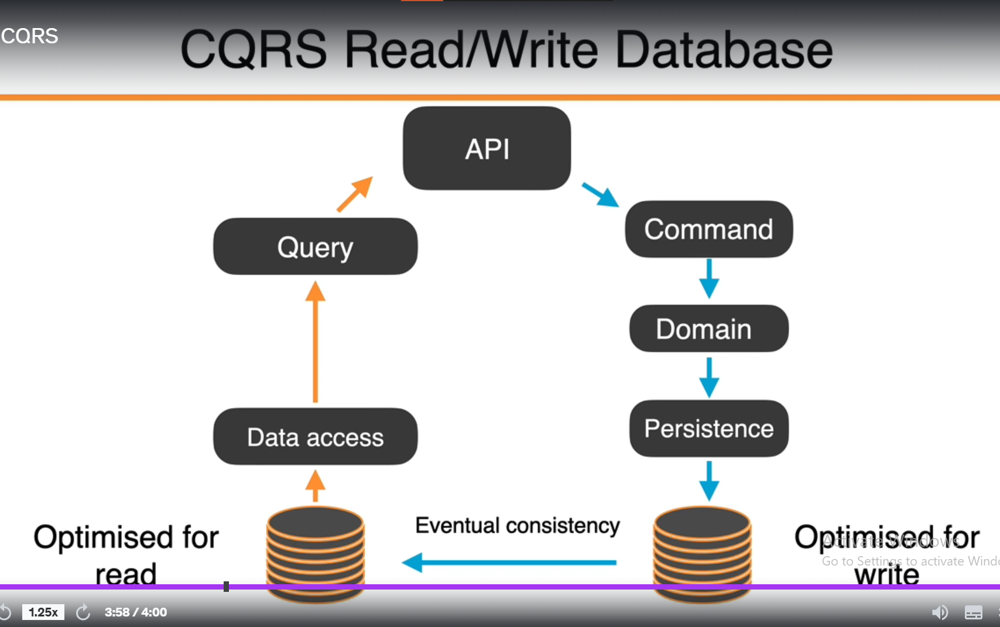

# CQRS - Command Query Responsibility Segregation | Command & Query Seperation
> CQRS is the pattern and architecture we're using to create our CRUD operations.
> : CQRS is concerned with the flow of data.

| Command | Query   |
|-------------- | -------------- |
| Does something| Answers a question|
| Modifies state| Does not modify state|
| Should not return a value| Should return value|

