# 1- .NET vs .NET Core:
## What is ASP.NET?
> Web development platform used to create websites, apps and web services, a collection of HTML, CSS and JS released in 2002.Works on HTTP and uses HTTP commands & policies to set a browser to server **bilateral (double sided)** communication.

## .NET Framework
> Primary .NET platform to build Windows desktop & serer-based applications. Includes ASP.NET for web apps, ADO.NET for data access, and Windows Communication Foundation (WCF) for service-oriented apps. Provides a controlled programming environment where software can be developed, install and executed on Windows sytstems.
> : It's also used to create Windows apps and games.
> : - Overall it focues on Windows.

## .NET CORE
> Cross-platform version of .NET for building websites, services and console apps. Open source, supports Windows, MacOS, Linux and can be used in a device, cloud, AI or IoT apps. Supports use of microservices.
> : Microservices mean that you can create and deploy independent function-specific apps.
> : - A corss platform version of .NET.

# 2-  Which Version Is The Most Recent and What Are The Changes?
*Taken from [here](https://www.youtube.com/watch?v=9NqthBLHBDg&ab_channel=IAmTimCorey)*
> - Regex improvements, (general speed improvements)
> - Simplified LINQ ordering, (Language Integrated Query)
> - Reflection Improvements
> - App trimming improvements, when you build self contained apps, you can trim out all the things you need. Allows to trim out all the parts of dotnet that aren't related to the app and result in smaller .exe apps.
> - Memory caching improvements, 
> - Tar file creation, allows to create linux distribution
> - Blazor changes (Blazor is a free and open-source web framework by Microsoft. Allows creation of web apps with only C# and HTML inteaad of relying on JS and its frameworks.)
> - API Improvements, rate limiting etc.
>
> .NET 7 could be outdated in 2024, since .NET production is a short term one.

# 3- JSON vs XML
## JSON
> - Data is stored in key/value pairs.
> - Easy to read and write.
> - Lightweight and good for mobile apps.
> - Faster Because does not require closing tags.
> - Only data oriented

## XML
> - Data is stored in tags similar to HTML.
> - Both machine and human readable.
> - Document oriented, which can be used as plain document.
> - Requires closing tags and is considered verbose compared to JSON.
> 

# 4- SOAP (Simple Object Access Protocol)
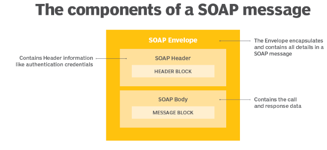
> A messaging protocol specification for exchanging structured information in the implementation of web services in computer networks. It uses XML to encode its messages and generally uses HTTP.
> : - SOAP is a protocol for exchanging information among computers,
> : - Can be used in any programming language with web service support.
> : - SOAP web services can be written in any programming language and executed in any platform.
> : - SOAP uses XML for its message format.
> : - Used to invode methods on remote objects, services, components, and processes.
> : - SOAP messages are simple and can be extended allowing developers to write custom code.
> : - Has built in error handling.

# 4.1- SOAP vs REST
> 
| REST  |   -| SOAP   |
|-------------- | -------------- | -------------- |
| Is a set of contraints for building web services, not a standard.    | -     | Is a standard.     |
| Messages are usually sent in JSON, does not support XML, YAML   | -     | Uses XML for sending and recieving messages   |
| Consume less fewer resources   | -     | XML usage may cause slower parsing and increased resource usage   |
| ACID relies on other protocols. Requires additional error handling and securing.  | -     | Has built-in error handling. Support ACID transcaction properties (Atomicity, Concurrency, Isolation, Durability). Fit for reliable services such as financial.  |
| Typically operate on HTTP(s) but can use any protocol.  | -     | Can operate any protocol such as HTTP, SMTP, TCP, UDP, etc  |
> Overall **REST** is more flexible and popular among public APIs. SOAP is good for specific use cases such as enterprise apps over private networks.


# 5- What Is Unit Testing and Why Is It Written (From Course Notes)
# Unit Testing
> Taking a unit and testing it in isolation, and validating that it works correctly. The company sets a unit testing percentage and the test team checks if the isolated code's test cases are covering up that much, and the test team checks it. 
>  
> Examples
> 
> : _In procedural programming_: A function or an indidividual program.
> 
> : _In OOP:_ A method or a class. Developers are reuired to write test cases for their classes and cases must cover all the functions in the class so that each function in the class is executed.
>
> Example unit testinf frameworks
> : JUnit for Java
> : CPPUnit for C++
>
> Typically unit test case has 3 sequences.
> 1. Sets up an environment for testing. It takes the system from initial step to the failing state, that's why its called **set up**.
> 2. Tests the unit. Each test comes with its own test oracle (tells if the test is successful or not). Each unit test case should be able to tell whether the results are correct or not.
> 3. Tears down the environment again to the initial state. We perform the tests in an isolated way, so we need to check if the system is able to handle the tasks successfully in the integrated model too. Say a function drops a table, and works perfectly well isolated, but another function may need to insert an element to the table, and thats what the **tear down** part helps us to do.

# 6- xUnit vs Nunit
> Both are frameworks used for writing and executing tests in .NET environment.

## 6.1- xUnit
> Free, open-source testing tool for .NET Framework. Newer compared to Nunit. 
> : Design principle of xUnit emphasizes test isolation. Uses modern and unique assertions. More extensible and customizable compared to Nunit. Supports parallel testing.

## 6.2- Nunit
> Oldest and most widely used testing framework for .NET. Free and open-source.
> : Allows to write setup code that has to run before each test and teardown after each test.
> : Uses classic assertion syntax similar to JUnit for Java.
> : Widely used and has various documentation online
> : Does not support parallel testing.

# 7- SOLID Principles
## Single Responsibility Principle
> A calss should do one thing and it should have only a single reason to change.
> : A calss should have one job.
> - Simplifies maintenance of the class and makes the system more robust.

## Open-Closed Principle
> Objects or entities should be open for extension but closed for modification. 
> : Means that a class should be extendable without modifying itself.
> - Coding to an interface is an intergral part of the SOLID.

## Liskov Substitution Principle 
> Let q(x) be a property a provable about objects of x of type T. Then q(y) should be provable for objects y of type S where S is a subtype of T.
> : Means that every subclass or derieved calss should be substitutable for their base or parent class.

## Interface Segregation Principle
> Segregation means keeping things seperate, and the Interface Segregation Principle is about seperating the interfaces.
> : The principle states that many client-specific interfaces are better than one general-purpose interface. Clients should not be forced to implement a function they don't need.

## Dependency Inversion Principle
> Entitites must depend on abstractions, not on concreations. It states taht the high-level module must not depend on the low-level module but they should depend on abstractions. 
> : This principle allows for decoupling.
> - In other words Principle states that our classes should depend upon interfaces or abstract classes instead of concrete classes and functions.
> - Abstraction is a fundamental principle taht allows programmers to hide the complex implementation details of functionality and expose only the esential features to the users.


# Why use RabbitMQ? 
> RabbitMQ is a messaging broker, an intermediary for messaging. Gives applications a common platform to send and receive messages, and messages a safe place until received.
> - **Reliability:** Guarantees that no message will get lost. 
> - **Flexible Routing**
> - **Clustering**
> - **Federation**
> - **Highly Available Queues**
> - **Multi-protocol**
> - **Many Clients**
> - **Management UI**
> - **Tracing**
> - **Plugin System**
>
> It allows applications to be decoupled meaning that producers do not need to have any knowledge about what applications will do something with the messages. It is useful in microservoce architercture where you want to keep the services as independent as possible.
>
> It is scalable and can meet high-performance needs. Supports multiple messaging protocols, queuing, delivery acknowledgement, flexible routing to queues and multiple exchange type.
>
> Provides features like routing and task distribution, and message brokering. 
>
> Has fault tolerance, provides high availbility and clustering. Even if one broker goes down, messages can be routed via others, allowing systems to survive failures of individual nodes.
>
> Overall good fit when you need a robust and reliable system for passing messages between apps. Especially beneficial for systems with microservice architecture or systems requiring peak performance and reliability.

# References
> - https://dotnet.microsoft.com/en-us/learn/dotnet/what-is-dotnet
> - https://www.youtube.com/watch?v=9NqthBLHBDg&ab_channel=IAmTimCorey
> - https://www.techtarget.com/searchapparchitecture/definition/SOAP-Simple-Object-Access-Protocol
> - https://www.freecodecamp.org/news/solid-principles-explained-in-plain-english/
> - https://www.digitalocean.com/community/conceptual-articles/s-o-l-i-d-the-first-five-principles-of-object-oriented-design
> - https://www.rabbitmq.com/features.html


# Databases
## 1- Relational Database (SQL) - From Course Notes
> Table-based and designed to manage relationships between data points. They follow ACID properties. Useful when data integrity and consistency are paramount. Ideal for complex querying and managind related data, where relationships are important.
> 
> ___`A`tomicity:___  All or nothing, finish all oeprations or do nothing.
> 
> ___`C`onsistency:___ A Transaction takes database from one consistent state to another.
>
> ___`I`solation:___ System executes its operations sequentially.
>
> ___`D`urability:___ When Transaction finishes, all changes mush be reflected to the DB.

## 2- NoSQL Database
> Don't use tables for data organization. Highly flexible and scalable, can ahndle large volumes of data and data types. Useful when data structure is not clear or subject to change.
> > ___Document Databases:___ Store data in document-like structures (JSON). Useful for semi-structured data.
> - Examples are MongoDB and CouchDB.
>
> > ___Key-Value Stores:___ Each value is associated with a unique key.
> - Examples are Redis and DynamoDB. Perfect for session management, caching and storing user preferences where you have simple data and rapid access is important.
>
> > ___Wide-ColumN Stores:___ Designed to store data in columns unline traditional relational databases that store data in rows and columns. Great for querying large data volumes. 
> - Examples are Cassandra and Hbase. Useful for analyzing huge data sets. Used in internet and recommendation systems.
>
> > ___Graph Databases:___ Designed to store data in graph structure, ideal for handling data sets that have complex relationships. 
> - Examples are Neo4j and Amazon Neptune. Ideal for social networks recommendation systems and fraud detection, where relationships and connections are of primary concern/importance.

## 3- In-Memory Databases(IMDBs)
> Reside in main memory instead on a disk so it has faster response time. Useful for apps requiring microsecond response times such as telecommunications and mobile advertising. 
> - Examples are Redis and Memcached. Useful when microsecond response times, caching, session maangement, gaming and real time analytics.

## 4- Object-Oriented Databases
> Represents data as objects, similar to OOP. Allows for more complex data relationsips and hierarchies than relational databases. Useful for representing relationships between many different entitites, similar to OOP.

## 5-Time-Series Databases
> Optimized for handling time-series data which are data points indexed in time order. They're heavily used in analytics, financial sector, IoT devices, etc.
> - Examples include InlfluxDB and TimescaleDB. Useful when handling time-stampled data such as IoT apps, stock trading, and fleet tracking.

## 6- Distributed Databases
> Spread the data across multiple nodes. Provides better reliability, scalibility and performance. Can be either a SQL or NoSQL database. Useful when you have large amounts of data that needs to be stored across multiple servers. Can handle high volumes of read/write operations and are inherently scalable. 
> -  Google's Spanner (SQL) and Apache Cassandra (NoSQL).

# Fundamental SQL Scripts
## 1. CREATE TABLE
> Used for creating new table in a db.
> ```SQL
> CREATE TABLE Students(
>     ID INT PRIMARY KEY,
>     Name VARCHAR(100),
>     Age INT
> );
> ```
## 2. INSERT INTO
> Used to insert new data into a table.
>```SQL
> INSERTY INTO Students(ID,Name,Age) VALUES (1, 'Egemen', 22);
>```

## 3. SELECT
> Used to select data from a db. Returned data is stored in a result table called the result set.
> ```SQL
> SELECT * FROM Students; // select all students
> SELECT Name, Age FROM Students; // select individual columns
> ```

## 4. UPDATE
> Used to update existing data in a table.
> ```sql
> UPDATE Students SET Age=23 WHERE ID=1;
>```

## 5. DELETE
> Delete existing record from a table
> ```SQL
> DELETE FROM Students WHERE ID=1;
> ```

## 6. WHERE
> Used to filter records.
> ```SQL
> SELECT * FROM Students WHERE Age > 21;
> ```

## 7. JOIN
> Combines rows from two or more tables based on relation a related column between them.  There are several types of SQL JOINs - INNER JOIN, LEFT (OUTER) JOIN, RIGHT (OUTER) JOIN, and FULL (OUTER) JOIN.
> ```SQL
> SELECT Orders.OrderID, Customers.CustomerName
> FROM Orders
> INNER JOIN Customers ON Orders.CustomerID=Customers.CustomerID;
> ```

## 8. GROUP BY
> Groups rows with same values in specified columns into aggregated data.
> ```SQL
> SELECT COUNT(ID), Age, FROM Students GROUP BY Age;
> ```

## 9. ORDER BY
> Used to sort the output of a statement in ascending or descending order.
> ```SQL
> SELECT * FROM Students ORDER BY Age DESC;
> ```

## 10. ALTER TABLE
> Used to add, delete/drop orr modify columns in an existing table.
> ```SQL
> ALTER TABLE Students ADD Email VARCHAR(255);
> ```

# 'KEY' Concepts in SQL - Course Notes
> Given a set of attributes K of a relation R, if K determines the whole relation R (i.e. K ⟶ R), then K `may be` a key.
>
> If K⟶R and `no proper subset` of K determines the whole relation R, then K is **`Definately a key!`** 
>
> There may be more than one key for R, therefore they are called `candidate keys.`
> : One of the candidate keys is selected as the `Primary Key`.

## Key, Candidate Key and Super Key
> If K⟶R and no proper subset of K determines the whole relation R, then K is a `key`, which we also call as a `candidate key`.
> 
> A candidate key should be `minimal`, meaning there is not any proper subset of K with the same property.
>
> If K⟶R and `proper subset of K determines the whole relation R, then K is called a Super Key.`

## Primary Key
> A Primary Key is a column or a set of columns in a table that uniquely identifies every row in that table. The primary key must contain unique values. If the primary key consists of multiple columns, the combination of values in these columns must be unique too, meaning that there should be no redundant combinations.
> : Primary Key is used to maintain data integrity and to efficiently search for, sort and organize data.

## Foreign Key
> Foreign Key is a column or set of colujmns in one table that references the primary key in another table. 
> : The table containing the Foreign Key is called the **`child table`** 
> 
> : The table containing the primary key is called the **`referenced/parent`** table.

## Index
> Index in a database is similar to an index in a book. Index is a pointer to data in a table.
>
> An index in a database is a data structure thatimproves the data retrieval operations. It removes the need to perform a full table scan.
>
> Indexes take up additional storage space and can slow down UPDATE and INSERT operations.


## Join Usage
> JOIN clause in SQL is used to comine rows from two or more tables, based on a related column between them.

$$ \huge \text {A sample table for JOINs} $$
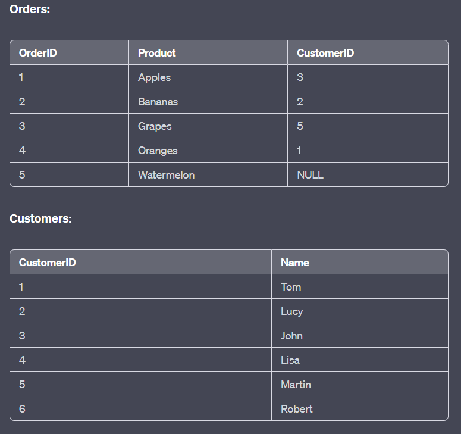

### 1. INNER JOIN
> Selects records that have matching values in both tables.
> - Returns rows from both tables where there is match.
>
> ```SQL
> SELECT Orders.OrderID, Customers.CustomerName
> FROM Orders
> INNER JOIN Customers ON Orders.CustomerID=Customers.CustomerID;
> ```
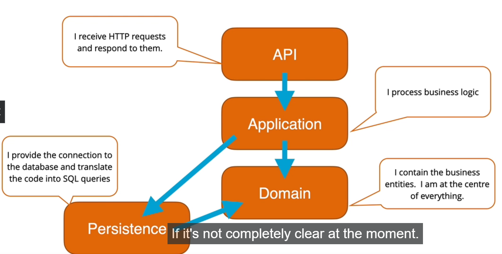

### 2. LEFT (OUTER JOIN)
> Returns all records from the table (table1), and the matched records from the right table (table2). The result is `NULL` on the right side when there is no match.
> ```SQL
> SELECT Orders.OrderID, Orders.Product, Customers.Name
> FROM Orders
> LEFT JOIN Customers ON Orders.CustomerID = Customers.CustomerID;
> ```
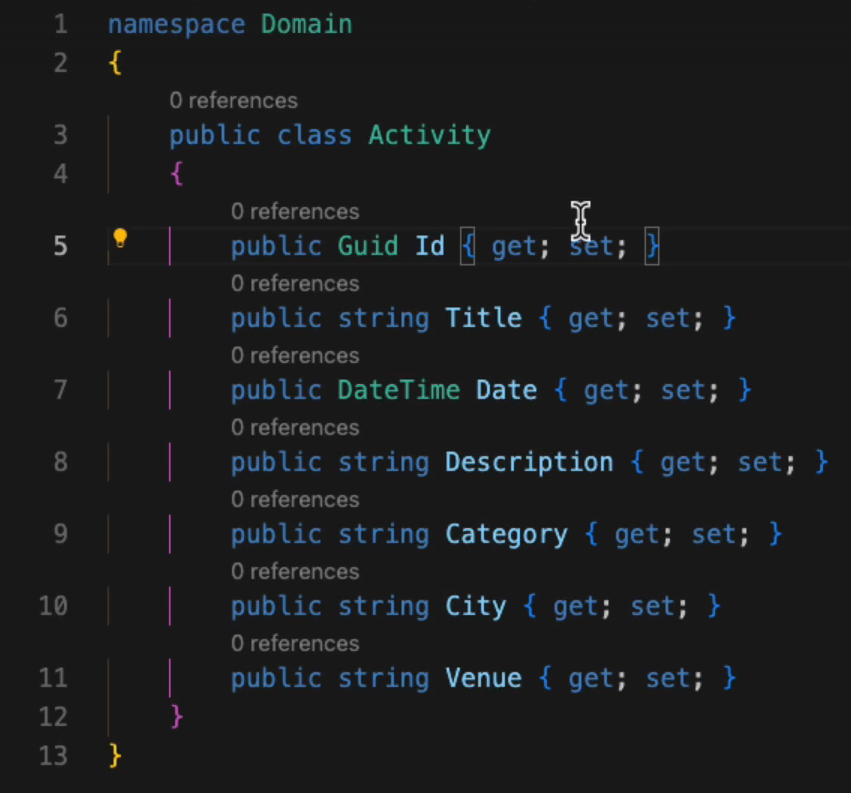

### 3. RIGHT (OUTER) JOIN
> Returns all records from the right table (table2), and the matched records from the left table (table1). The result is `NULL` on the left hand side when there is no match.
> ```SQL
> SELECT Orders.OrderID, Orders.Product, Customers.Name
> FROM Orders
> RIGHT JOIN Customers ON Orders.CustomerID = Customers.CustomerID;
> ```
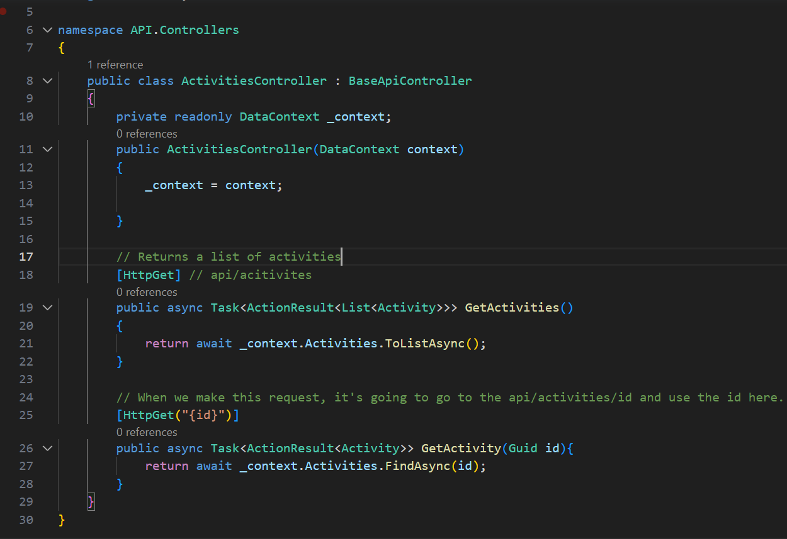

### 4. FULL (OUTER) JOIN
> Returns all records when there is a match in either left (table1) or right (table2) table records.
> ```SQL
> SELECT Orders.OrderID, Orders.Product, Customers.Name
> FROM Orders
> FULL OUTER JOIN Customers ON Orders.CustomerID = Customers.CustomerID;
> ```
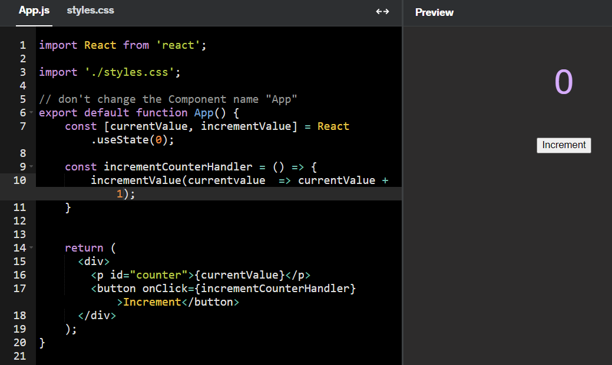

$$ \huge \text {A sample table for SELF JOIN} $$
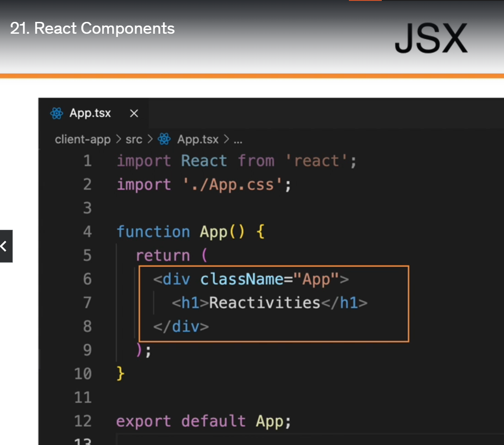
### 5. SELF JOIN
> This is a regular join, but the table is joined with itself.
> : Used to combine rows with other rows in the same table when there is a match.
> ```SQL
> SELECT E1.Name AS Employee, E2.Name AS Manager
> FROM Employees E1
> LEFT JOIN Employees E2 ON E1.ManagerID = E2.EmployeeID;
>```
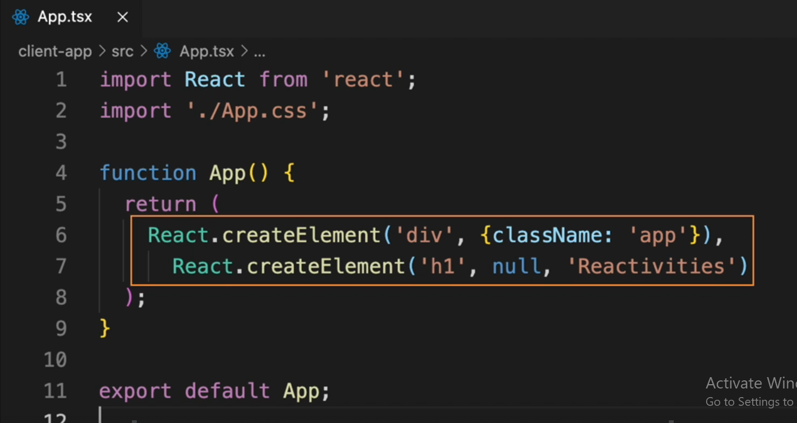

### 6. CROSS JOIN
> Matches every row of the first table with every row of the second table. If the input tables have n and m rows respectively, the resulting table will have n*m rows.
> : This would give you a combination of every order with every customer, resulting in 30 rows (5 orders * 6 customers). 


## Deadlocks - Course Notes
### Locking and Deadlocks
> ___Deadlock:___ Cycle of locks waiting for locks released by each other two ways of dealing with deadlocks.
### 1. Deadlock Detection
> Create a `wait-for graph`.
> : Nodes are Transactions
> : There is an edge from Tᵢ to Tⱼ if Tᵢ is waiting for Tⱼ to release a lock.
>
> Periodically check for cycles in the wait-for graph.
### 2. Deadlock Prevention
> If a Transaction restarts, make sure it has its original timestamp.
>
> Assign properties based on timestamps. Assume Tᵢ wants a lock Tⱼ holds. Two policies are possible.
> 1. ___Wait-Die:___ If Tᵢ has higher priority, Tⱼ waits for Tᵢ. Otherwise Tᵢ aborts.
>    - Allows for waiting since T₁ has higher priority. T₃ wants a lock T₁ holds, so T₃ aborts.
> 2. ___Wound-Wait:___ If Tᵢ has higher priority, Tⱼ aborts. Otherwise Tᵢ waits.
>    - Don't allow waiting, If T₁ has higher priority, others abort. Tᵢ has higher priority than Tⱼ so Tⱼ aborts.

# RabbitMQ
> RabbitMQ is often called a message broker. Real life example is like a postal service that's responsible for getting our letters from **Point A** to **Point B**.
> - RabbitMQ is responsible for getting our messages from consumer to producer.

## Producers & Consumers
> ___`Producer:`___ Something that is publishing a message into RabbitMQ. Producer could be imageined as if they just want to drop the letter off safe in the knowledge it will get to its final destionation.
>
> ___`Message Broker:`___ Knows how to forward our messages to our final destination. 
>
> Synchronous communication will be something like making a http get request for a web based API. Wait until API responds yada yada. 
>
> ___`Consumers:`___ Entities/programs listening to the messages that come off the message broker. We can have multiple consumers listening to mesages off the message broker and have multiple producers pushing messages into the same message broker. Both ways the communication is **`Asynchronous`**.
> - It means that producers don't have to wait for the messages to be delivered and consumers don't have to wait for the messages to get sent.

## Exchanges & Queues
> ___`Exchange`___ is the brain behind RabbitMQ. It knows how we want to root our message from producer to consumer. Imagineas inner wokrings of the postal service. A message broker can have many different exchanges and an exchange is what a producer always sends its messages to.
>
> ___`Queue:`___ An exchange will push messages into one or more cues. Message will sit in these queues until they are read or consumed by an interested party. Imagine like a letter box. 
> - Consumer is responsible for reading messages from its queue. Like an exchange, a message broker can have multiple queues. Queues are tied to exchanges and it is known as ___binding___. 
>
> An exchange can be tied to many queues, and also a queue can be tied to many exchanges. Consumers listen to these queues. Consumer can listen to multiple queues or none.
> 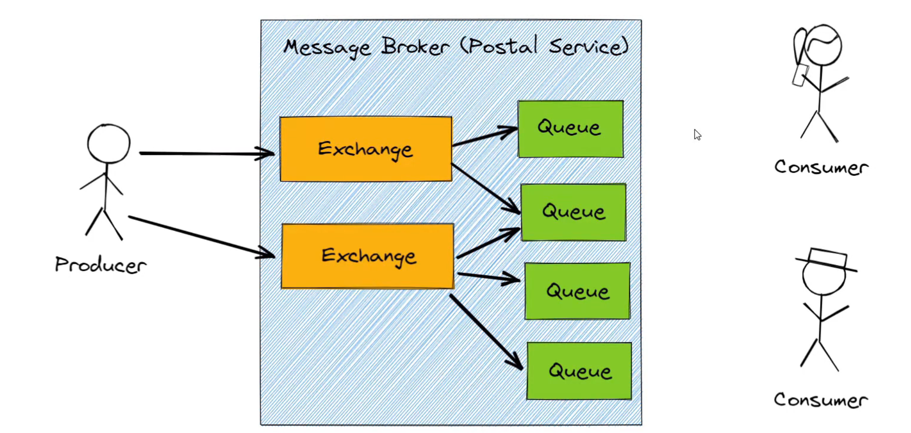
> 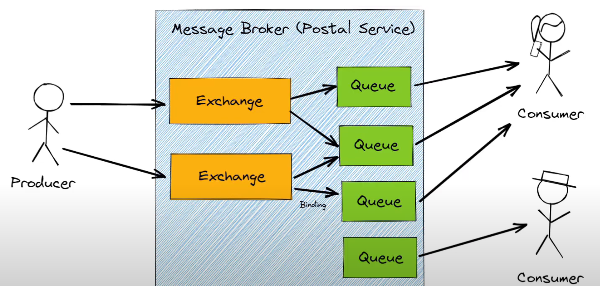 

## Connections & Channels
> Every producer or consumer should open a single TCP connection to our RabbitMQ broker. A connection can have multiple channels. 
> - By using a connection with multiple channels, a producer can produce and push messages into our broker using different threads.
>   - Each thread uses a different channel so these messages are isolated from one another.
>
> By using channels and not opening multiple connections, we can save a lot of resources. The same is true for consumers who only have one connection but might have multiple channels.

## Request & Reply Pattern
### Client
> Client is responsible for publishing requests onto RabbitMQ and consuming replies from the server.

# Javascript Refresher
> ___Defer:___ is used in the scriptt ag to run the script after the html code loads.
>
> ___Module:___ used with type='module'. Treats the script as a module and allows you to use import/export.


## React Projects Use a Build Process
> The code we write transforms into a version before its handed off to a browser
>
> Raw React code won't execute in the browser.
>
> Code we write is minified.
>
> You must have one default export in a file.
>
> 
> 

## React Is Written In A Declerative Way
### How is a component built
> A comination of html css and js components to build up a UI, resulting in a React component. 
>
> Creating re-usable and reactive components consisting of HTML and Javascript and CSS is known as definitive approach
>
> Components are just functions returning html codes.

## useState()
> To handle changes and refresh content, we use useState() hook
> : It wants a default state value. Returns an array of two elements
>   : First one is the current state value and second is a function for updating that
>
> React uses a `Virtual DOM`
> : Virtual DOM is a representation of the UI that's kept in memory and synced with the real DOM by react.
>
> If we want to give a component some state, then there's a hook we could use called `useState()`.

## useEffect()
> `useEffect()` allows us to hook into lifecycle events inside our component. useEffet re-runs only if a change in its dependencies occur between renders.
> - So when our component mounts or is initialized on our page, then we can use useEffect() to add a side effect to our function so that something happens when our component mounts.
> : ___Component Mounting:___ It means that the component is being rendered into the HTML and is becoming a part of the webpage.

## You Can Create Your Own Hooks Too!

### One Way Binding
> The flow of data can go from the React component via the virtual DOM to the DOM itself, and not in the opposite direction.


### JSX
> This is the JSX Syntax, may seem like HTML, but it is Javascript.
> 
>
> Here's the same thing done by plain javascript:
> 

### React Hooks
> Hooks are functions that let us hook into the state and lifecycle features from function components.


## Input Checking
> 

## Increment Button
> 

---
# Typescripts
> Typescript can catch typos while you're writing the code, instead of after runtime.

| Pros   | Cons   |
|-------------- | -------------- |
| Strong Typing| More Upfront Code|
| Object Oriented | Not all 3ʳᵈ Party have TS definition file|
| Better Intellisense| Strict mode is strict |
| Acces modifiers | |
| Future JS Features| |
| Catches Silly Mistakes In Development| |
| 3ʳᵈ Party Libraries| |
| Easy To Learn If You Know JS| |
| Much improved in React| |


---


# The Backbone Of DOTNET Apps
## Entities
> There are various entities named API, Application, Domain and Persistence.
> : 

## A Sample Domain Entity
> 

> DB Sets stand for the table that we're going to create.

## Creating a Migration
> It creates the code that generates the schema we need inside our database.

```dotnet 
dotnet ef 
```
> stands for dotnet entitiy framework


> Creating first migration
```dotnet
dotnet ef migrations add InitialCreate -s API -p .\Persistence\
```
> It creates a folder named Migrations inside Persistence folder. There are 3 files and bottom 2 are for the db to rollback when neeeded.

> When we run our app, the no-hot-reload will watch our file and reload the server when a change occurs. Similar to nodemon.
```dotnet
dotnet watch --no-hot-reload
```

> We create controllers so we can query the data and return it inside of an HTTP response.

> The API creation is similar to the Spring framework.
> : 

> API depends on Application which depends on Domain.
> - We have a Persistence (read/write/delete) records to disk or database, which has a dependency from the application and to the domain.

## Benefit Of Using SQLite For Development
> It makes the code portable. We can save our database into the source control

# C# Notes
> ___`Guid:`___ Stands for globally unique identifier. It's a 128 bit integer that's used to uniquely identify something. 
> : It's used as a primary key in a DB

# CQRS - Command Query Responsibility Segregation | Command & Query Seperation
> CQRS is the pattern and architecture we're using to create our CRUD operations.
> : CQRS is concerned with the flow of data.

| Command | Query   |
|-------------- | -------------- |
| Does something| Answers a question|
| Modifies state| Does not modify state|
| Should not return a value| Should return value|


# The Backbone Of DOTNET Apps
## Entities
> There are various entities named API, Application, Domain and Persistence.
> : 

## A Sample Domain Entity
> 

> DB Sets stand for the table that we're going to create.

## Creating a Migration
> It creates the code that generates the schema we need inside our database.

```dotnet 
dotnet ef 
```
> stands for dotnet entitiy framework


> Creating first migration
```dotnet
dotnet ef migrations add InitialCreate -s API -p .\Persistence\
```
> It creates a folder named Migrations inside Persistence folder. There are 3 files and bottom 2 are for the db to rollback when neeeded.

> When we run our app, the no-hot-reload will watch our file and reload the server when a change occurs. Similar to nodemon.
```dotnet
dotnet watch --no-hot-reload
```

> We create controllers so we can query the data and return it inside of an HTTP response.

> The API creation is similar to the Spring framework.
> : 

> API depends on Application which depends on Domain.
> - We have a Persistence (read/write/delete) records to disk or database, which has a dependency from the application and to the domain.

## Benefit Of Using SQLite For Development
> It makes the code portable. We can save our database into the source control

> The business logic will go into the Application layer.

## Some Notes About The Mediator Pattern
> Mediator pattern desing allows only one-way data flow. 
> : The communication is one way between the API and the Application layer.
>
> To handle dependencies, we install Mediatr extension from NuGet gallery.
> : 


> The dotnet restore is handy when you're not getting an access to a particular class/interface you think you should have access to.
> ```dotnet 
> dotnet restore
> ```

> There's a easier way to set properties of request items. An extension called AutoMapper Dependeny Injection from NuGet gallery will be used.
> 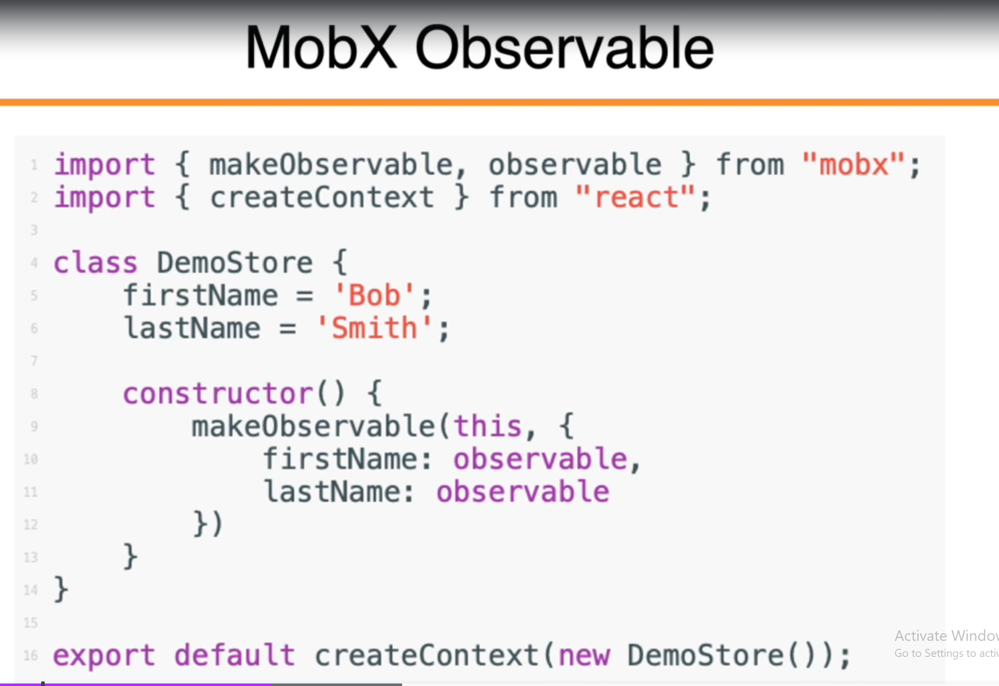

> AcitiviesController is simply where we store our API methods.

## About HTTP 204
> If you run get query on an element that is deleted and there's no error handling in the get API in case the content does not exists, Postman will return HTTP 204 - NO CONTENT code.

## Cancellation Notses - What Are They?
> Say the highlighted request here takes 30 seconds to process.
> 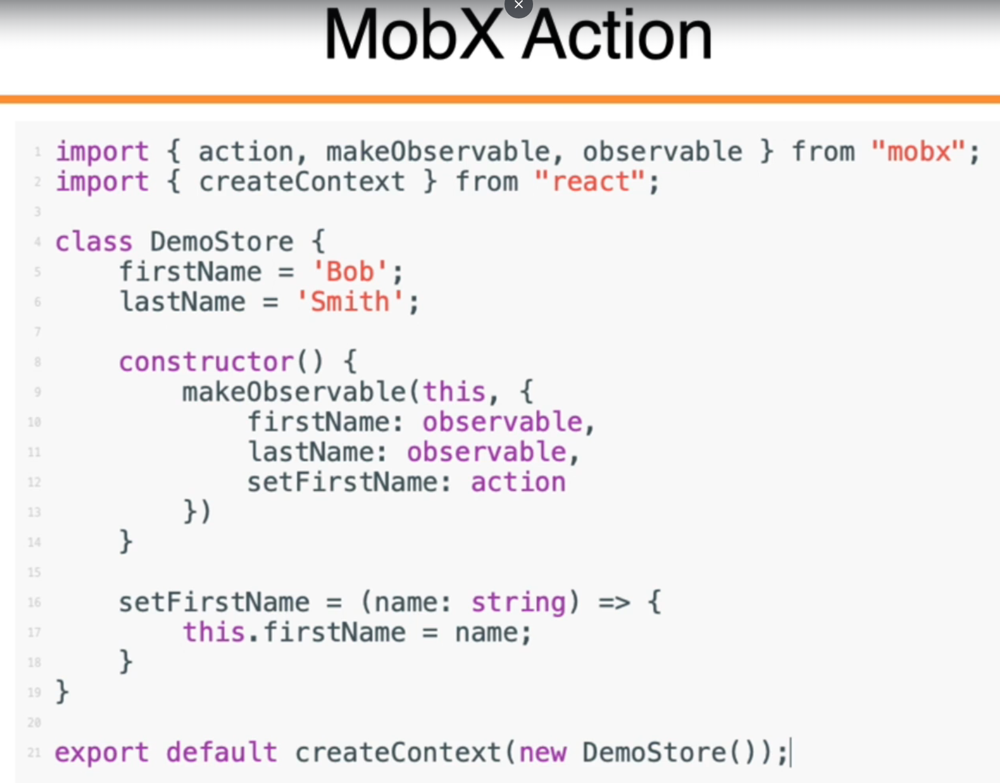
>
> Without utilising CancellationTokens the requests will keep on going on the server side regardless of user's action.

## Clean Architecture Pattern
> Allows easily mapping of different layers, by Uncle Bob 2012.
> 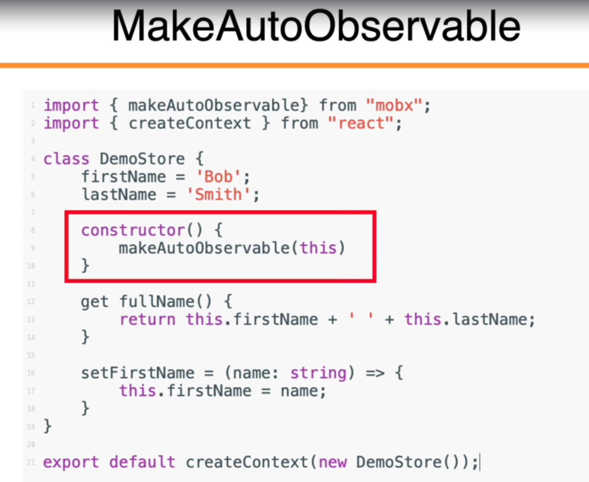
>
> Set of recommendations about how you can build an Application.

## CQRS + Mediator pattern
> ___`CQRS:`___ Stands for Command and Query Responsibility Segregation
>
> CQRS is generally mentioned with `Event Sourcing`.
> - Event sourcing is quite complex but an excellent tool. 
> -


## Mediator Pattern
> Mediator specifically relates to how we're using the flow of control in our application.
> - Our API Controllers send an Object to our Mediator, 
> - Mediator has a Handler that has a handler that's going to process our business logic and then
> it's going to send object back out to our API Controller, which in turn will return the object
> to the client inside an HTTP Response.

---
# React | Frontend Notes
> Folder Structure consists of 2 main folders:
> 1. ___`app folder:`___ Will have cross-cutting concerns,
> 2. ___`features folder:`___ Will contain all our our individual features that we build in this application

> For the sake of using standard conventions, we name our interfaces beginning with a capital I `I`.

### Remember that we need something (such as the div we use inside our return statements) while returning jsx, why we need it?
> If we don't have anything, then we're not allowed to return different elements inside a React Component, we can only return a single element but it can have as many children as it likes. 
> - To overcome this issue, we're using the extra div container. Preferably a Fragment could be used. An empty tag will do the job as well since its basically the shortcut of using a Fragment.
```Typescript
<>
  <Navbar />
  <Container style={{marginTop: '7em'}}>
    <List>
      {activities.map((activity) => (
        <List.Item key={activity.id}>{activity.title}</List.Item>
      ))}
    </List>
  </Container>
</>
```
>
> ___`Note:`___ On the inspection tool, if you use an empty div then there will be a div elemen with no attributes inside displayed as the parent of all children. If you replace that with a Fragment, the div will have class="root".
> 
> 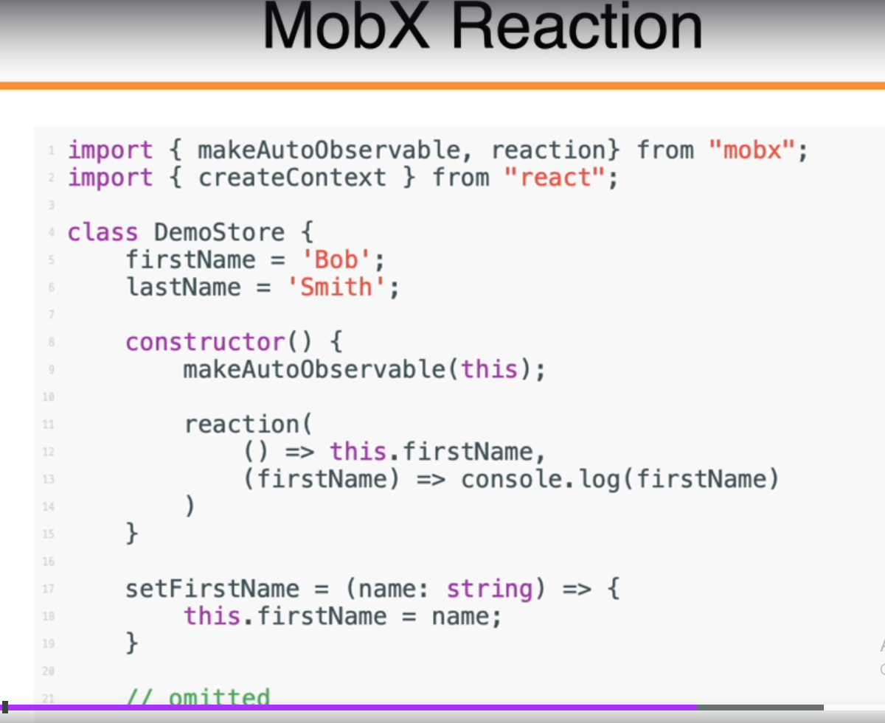 
>
> Say you have the same component but for different actions. Such as a form with same input values used both to edit and create an activity. In routes, they pointed to the same component and a component change was not happening, so the context was not re-rendering itself, because the form component is the same. To overcome this, we used the key value for the component to reset component state.
> 
> 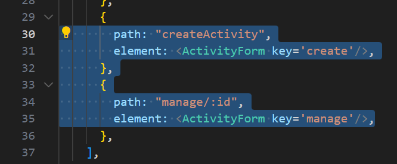
---
# MobX
## Why use MobX?
> MobX is the state management system we're going to use. Written in TypeScript and easily intergrible to an application written with TypeScript.
>
> Incredibly easy to work with.
>
> MobX makes it impossible to produce an inconsistent state. Compared to Redux, MobX creates mutable states that we can mutate directly. It does not use immutable structures so we can mutate our states.

## MobX Core Functions
> MobX uses `Observables` 
> - Observables are like the next stage that Promises will eventually become in JavaScript.
> - Observables are concerned with the state of something over time, unlike Promise, which is a one time thing.
>   - Observables are something you can observe, and as their state changes over time, then you can react to that state change.
>
> `Actions`
> - Actions change the state of Observables.
>
> `Computed Properties`
> - If we already have some state inside an observable and we want to derive from new state from what we already have, we use computed properties.
> - Computed properties are something we can observe and when their state changes, we can react accordingly.
>
> `Reactions`
> - Any of our observable states, we can react to it changing in some way and use a side effect.
>
> `AutoRun`
> - Very similar to Reactions, AutoRun will always run even when the Store is initialized before the observable you're reacting to has actually changed, whereas a Reaction will wait until the observable has changed from its initial state and then you'll react to that change.

## MobX Observable
> 
> : MobX uses Classes to Store the States. We create classes for each store we want to create and we can have multiple stores.

## MobX Action
> 

## Make Auto Observable
> 
> We're using arrow functions inside here because arrow functions automatically bind to a class in JavaScript, whereas normal functions do not and you need to take an action on a function or you need to to something extra with a function in order to bind it to a class.

## MobX Reaction
> 
> We can react to observable state changing automatically inside our classes. Here, the reaction takes two parameters, a function/expression to idenify what state we want to observe, and then we can do something with that state. Here it logs the name to the console every time the first name is updated.

### Reaction Context
> Normally in React we're passing down information from a parent component to child component and it is the only way to get access to a property with higher-hierarchy from a lower-hierarchy component.
> 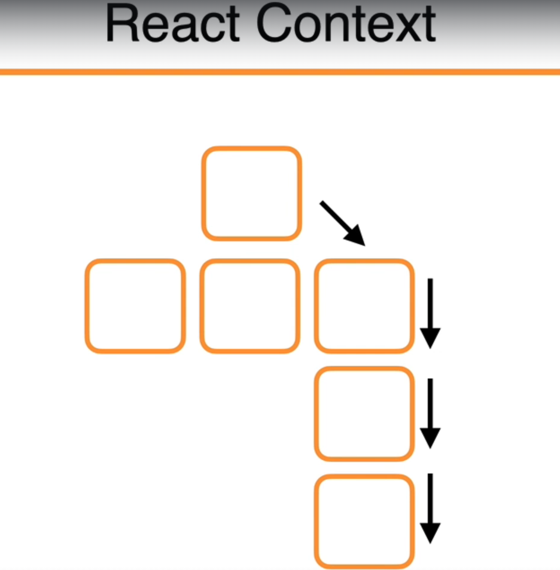
>
> With `React Context`, each component is going to be able to directly access the MobX store directly, without need of a middleman to pass down props to. We're simply going to have a component that's going to be able to access the store directly to render a view in user interface.

## React Context 
> 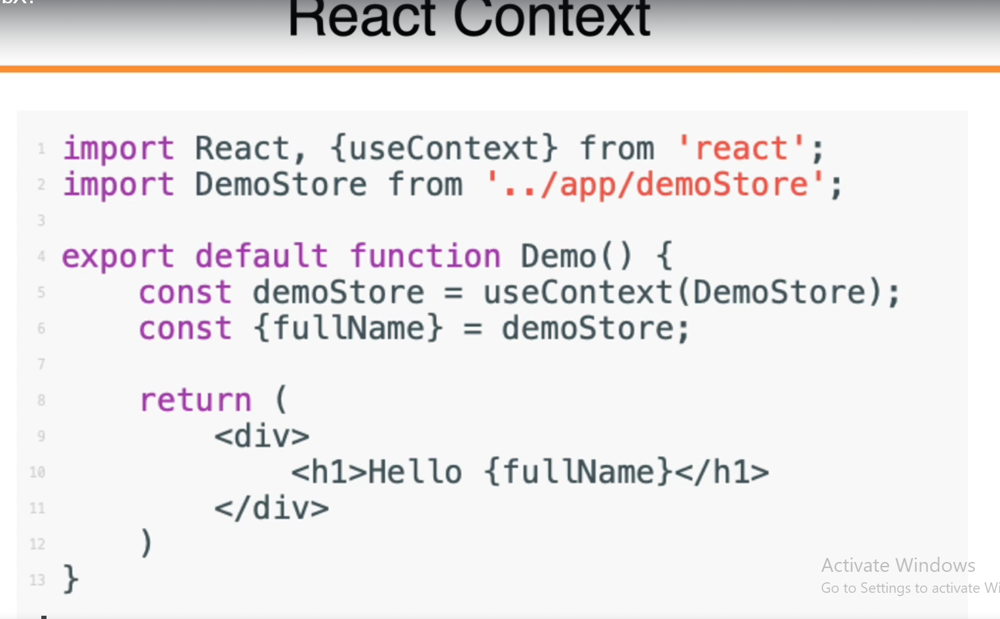
> When we use React context, we've got a hook available that we can make use of. In our MobX classes we create a Context, and then to consume the context we can use the `useContext()` method.

## MobX React Lite
> We want our components to have the power to Observe Observables inside our Mob stores. To help us with that, we'll use MobX React Lite.
> 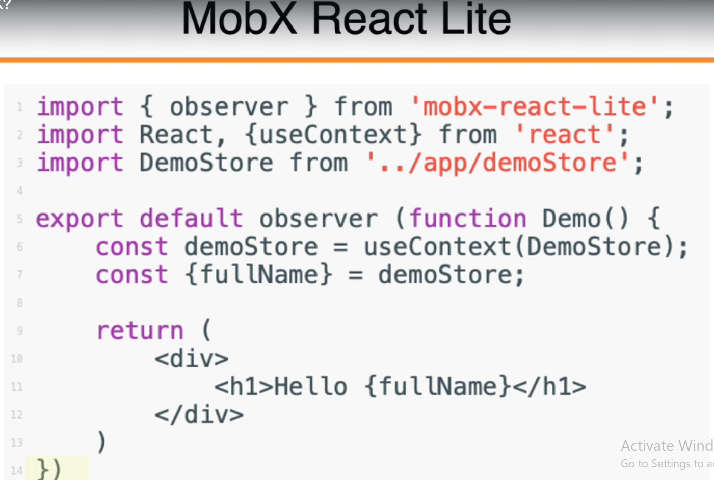
>
> - The `observer` imported from `mobx-react-lite` is a higher order function. A higher order function takes another function as a parameter. It returns a function with extra powers. It has the power to Observe Observables from the MobX store.

> Note that MobX is also written in TypeScript so we can guarantee that we have a TypeScript definition file that comes along.

> All local states in the app will be moved into a centralized state store.

## MobX Notes
> If using async/await + runInAction, we can leverage runInAction.
> : Not using runInAction will cause this error: 
> 
> 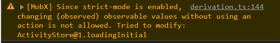
>
> The MobX strict mode enforces that any modification to the state must happen inside of an action.
> : So basically `runInAction` takes a piece of code and executes it inside of an anonymous function instead of having to manually create an action for it.
>
> With MobX, now our app has state management, cleaned up our back-end code for UI.
>
> Now, we're providing the stores via the React Context. Any component in our application can gain access to our store directly, it means we no longer need to treat components as middlemen for states or props that we're passing down to components.
>
> - Why not use Redux, it's more popular?
> : It was created before MobX. MobX is written in and uses TypeScript and easy to use with. In some cases MobX is faster than Redux as well, which is an author claim. 


## The Map Object
> https://developer.mozilla.org/en-US/docs/Web/JavaScript/Reference/Global_Objects/Map
>
> The `Map` object holds key-value pairs and remembers the original insertion order of the keys. Any value (both objects and primitive values) may be used as either a key or a value.
> : It allows for direct key, and if existent, value pair operations effectively.
>
> Used in the project for cleaner code.

## Routing
> 1. Why do we need a router?
> - SPAs (Single Page Applications) need routers, simply because we don't transition between pages but components. We only have index.html now. As apps get more complex, a need for routing emerges. To handle that, React-router is a fit choice.
> 2. React-router
> 3. React Router APIs
> - APIs are made extremely simple. We start off with a 
`BrowserRouter` and surround our app with it. Inside the app, we use `Route components` which get replaced with the components that we want to load when a particular route is navigated to. `Link` (adding a link to a button), `NavLink`(makes a button active when a link is clicked on) and `Redirect` (redirecting the user) take place of tags in our app as well.
>   - NavLink puts additional styling to the component it's used on and is pereferable in NavBars as it adds a highligting. Link on the other hand simply allows navigation between components with no additional styling. 
### React Router Hooks
> Allows hooking into the router state to get various pieces of information.
> - ___useHistory___ Keeps track of users current location or browser's location  
> - ___useLocation___ Where user is currently at
> - ___useParams___ If there are route parameters, say have an activity we want to fetch with the ID of the activity from the route, we use params.
> - ___useRouteMatch___
>
> 4. History Object
> - Keeps track of the current location and whenever we move location, we push a new route into the `History Object`. Whilst we're inside the context of our React app and inside the Browser Router, then our components are going to rerender when there's a change detected and the component we're looking at will be replaced by another component.

## Error Handling
> 1. Validation
> - Protect/validate the data
> 2. Handling HTTP Error Responses
> - We may need to send http error codes occasionally
> 3. Handling Exceptions
> - Centralize the handling of exceptions and deal with them in a custom middleware
> 4. Custom Middleware
>
> 5. Using Axios Interceptors
> - Centralize the error handling so we can build it once and forget it
>
> 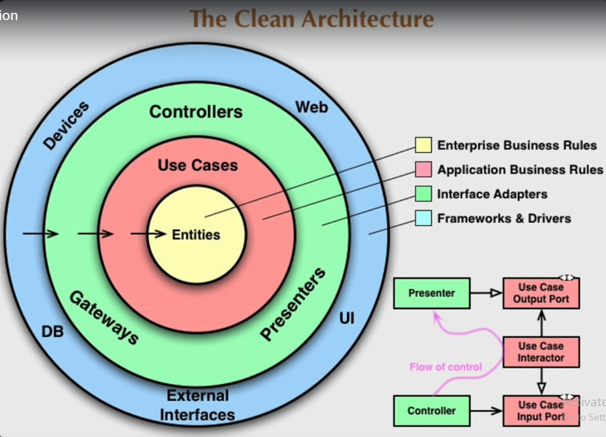

# A Key Rule of Clean Architecture - The Dependency Rule
> Goal of this is to encapsulate each ring of the architectural model and these dependencies can only point inwards.
>
> - So, our Application does not know about what technology is being used to present that data out to the client in the end.


## The Overall Logic Of the App
> The `Mediator` and our `API Controller` uses mediator handler, now our logic is contained inside the handler.
> - This is where we're going to be checking for errors. Suppose from our API Controller, we requested an activity with a guid that does not exist in our db. Then, our `Mediator Handler` is going to need to handle this logic and return the appropriate response to our Controller, but this cannot be a HTTP response because it dosn't know what techology its using to pass this object onto.
>
> 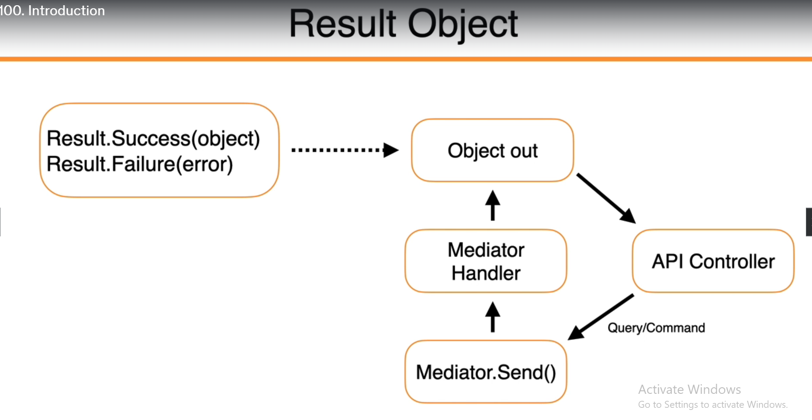
>
> 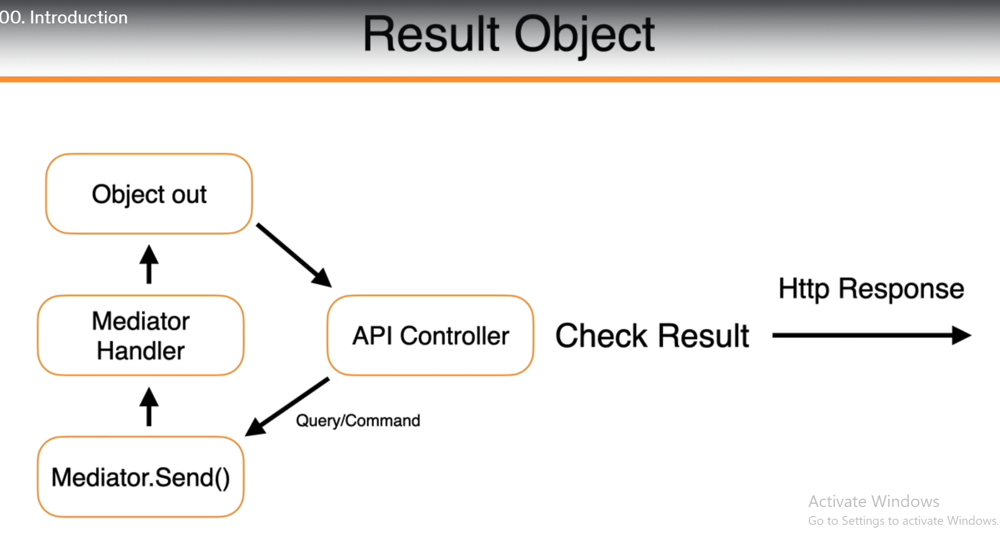

## API Controller On Validation
> When we make an attribute required on Domain entity, our API Controller is going to generate automatic HTTP 400 response if it encounters a validation error.
>
> Bad Request throwing is located in BaseApiController, and we're using that method inside ActivitesController. Basically the error is sent from BaseApiController.


> When we're talking about middleware, we're talking about our HTTP Request Pipeline.

## Formik
> Forms will be created with Formik.

## Date-fns
> For ensuring date type safety and display.
---

---
## Identity
> 1. ASP Core Identity
> - Membership system
> - Supports login stored in identity
> - Support for external providers
> - Comes with defeault stores
> - User manager
> - Signin manager
> 2. JWT Token Authentication
> 3. Login/Register
> 4. Authenticated Requests
> 
> Users will be a new entity. About the use cases, logging in and registering are our use cases. Authentication is part of the API project, not the Application. The Application layer will have no knowledge of the identity. It will have the knowledge of the entity that we are adding for the user but it will not know if the user is being authenticated or not. It's job is to process the Business Logic to retrieve activities and pass them out or updates or deletes etc.
>
> Identity will be a seperate system integrated into our Application. Application layer will be able to get the user's username, but not have any knowledge of our identity system.

## DTO's
> A Data Tansfer Object (DTO) is a data transfer object used to carry data between processes.

> If something you're creating doesn't involve data access, then it is not a Repository.
---

> 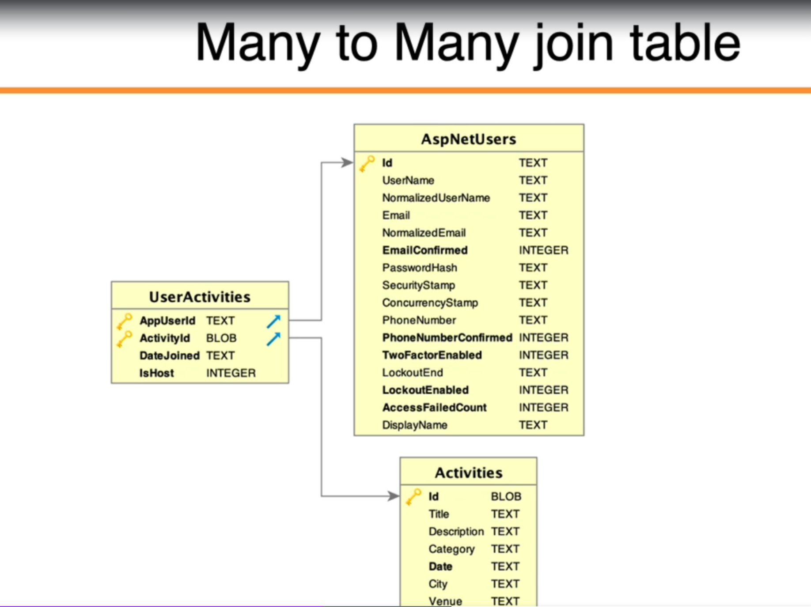
> 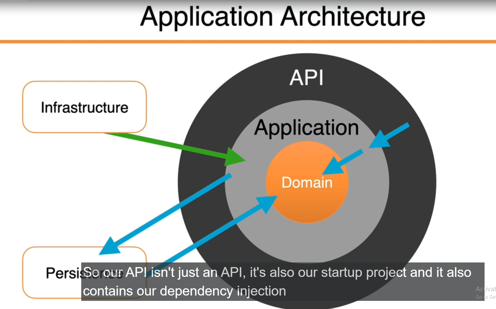
> 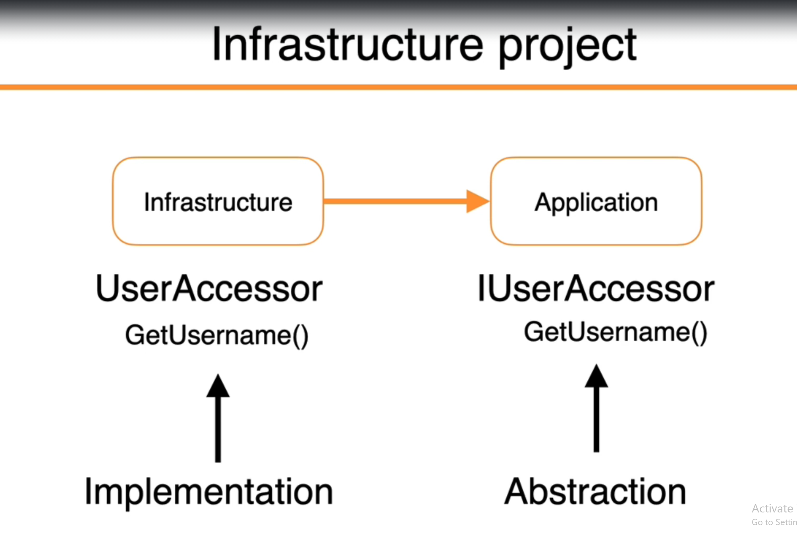